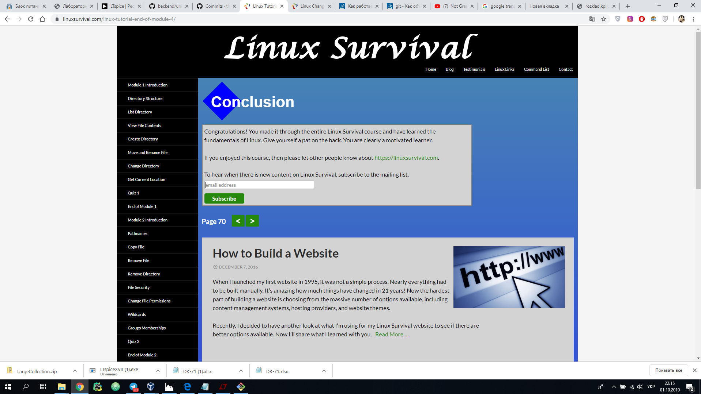
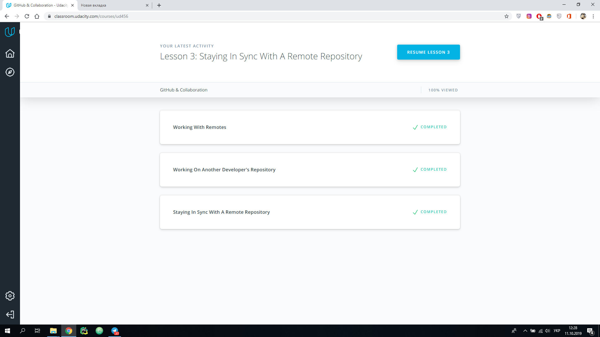
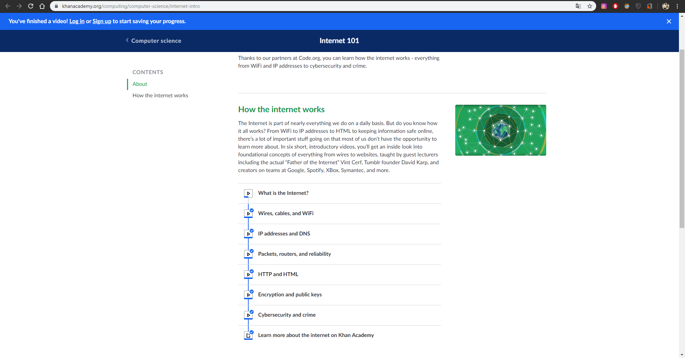
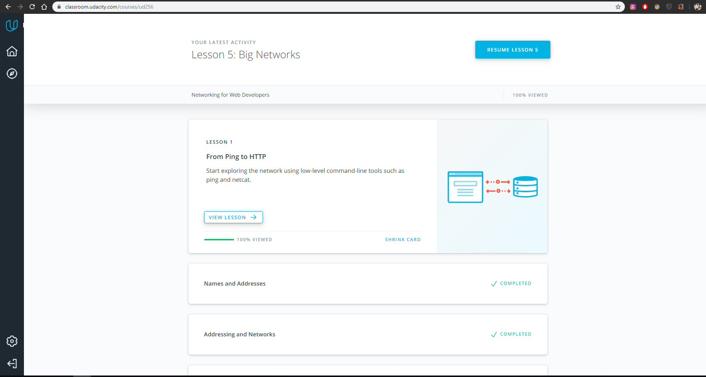

## Unix Shell



Now i use latest version of Linux distribution ``Manjaro Xfce`` in my VM machine. I need it for some special software, for my education in the university. 

Today i know all advantages and disadvantages of UNIX-like OS.

In the future i will use UNIX-like OS for solve my tasks.


## Git Collaboration




In this lesson, I take one briliant command, this is `` git rebase ``. In my opinion, I will use these features in the future, because sometimes large number of commit in our "repo" make it difficult to read the `` git log ``.

In general, all the material in the lessons was clear. Most of the features I knew before.


## Python Basics 1

[My HackerRank profile](https://www.hackerrank.com/grifin2234) 

In ``python_basics_1`` folder, you can check out my code.


Unfortunately I can't show more complex code in my ``python_basics_1``, because before that i was learning another programming languages and hardware description languages like ``c/c++ and Verilog``.


## Memory Management

1. - Program or app will crash.
2. - Allocations smaller than or equal to 128 KB derive from the heap, whereas larger allocations derive from anonymous memory mappings. 
3. - Text memory or program memory it is memery segment that store code of our program. This is read-only segment.  Data memory store the contents for static variables initialized in source code. This is read-write memory.

```
[laviss@laviss Desktop]$ cat /proc/834/maps
00400000-00417000 r-xp 00000000 08:01 1180485                            /usr/bin/man
00617000-00618000 r--p 00017000 08:01 1180485                            /usr/bin/man
00618000-0061a000 rw-p 00018000 08:01 1180485                            /usr/bin/man
013e1000-01522000 rw-p 00000000 00:00 0                                  [heap]
7fee6f64b000-7fee6f68c000 rw-p 00000000 00:00 0 
7fee6f68c000-7fee6fc32000 r--p 00000000 08:01 1187833                    /usr/lib/locale/locale-archive
7fee6fc32000-7fee6fc34000 rw-p 00000000 00:00 0 
7fee6fc34000-7fee6fc4a000 r-xp 00000000 08:01 1187836                    /usr/lib/libz.so.1.2.11
7fee6fc4a000-7fee6fe49000 ---p 00016000 08:01 1187836                    /usr/lib/libz.so.1.2.11
7fee6fe49000-7fee6fe4a000 r--p 00015000 08:01 1187836                    /usr/lib/libz.so.1.2.11
7fee6fe4a000-7fee6fe4b000 rw-p 00016000 08:01 1187836                    /usr/lib/libz.so.1.2.11
7fee6fe4b000-7fee6fe57000 r-xp 00000000 08:01 1185388                    /usr/lib/libgdbm.so.4.0.0
7fee6fe57000-7fee70057000 ---p 0000c000 08:01 1185388                    /usr/lib/libgdbm.so.4.0.0
7fee70057000-7fee70058000 r--p 0000c000 08:01 1185388                    /usr/lib/libgdbm.so.4.0.0
7fee70058000-7fee70059000 rw-p 0000d000 08:01 1185388                    /usr/lib/libgdbm.so.4.0.0
7fee70059000-7fee7007e000 r--p 00000000 08:01 1187767                    /usr/lib/libc-2.29.so
7fee7007e000-7fee701c8000 r-xp 00025000 08:01 1187767                    /usr/lib/libc-2.29.so
7fee701c8000-7fee70211000 r--p 0016f000 08:01 1187767                    /usr/lib/libc-2.29.so
7fee70211000-7fee70212000 ---p 001b8000 08:01 1187767                    /usr/lib/libc-2.29.so
7fee70212000-7fee70215000 r--p 001b8000 08:01 1187767                    /usr/lib/libc-2.29.so
7fee70215000-7fee70218000 rw-p 001bb000 08:01 1187767                    /usr/lib/libc-2.29.so
7fee70218000-7fee7021c000 rw-p 00000000 00:00 0 
7fee7021c000-7fee70229000 r-xp 00000000 08:01 1185527                    /usr/lib/libpipeline.so.1.4.2
7fee70229000-7fee70428000 ---p 0000d000 08:01 1185527                    /usr/lib/libpipeline.so.1.4.2
7fee70428000-7fee70429000 r--p 0000c000 08:01 1185527                    /usr/lib/libpipeline.so.1.4.2
7fee70429000-7fee7042a000 rw-p 0000d000 08:01 1185527                    /usr/lib/libpipeline.so.1.4.2
7fee70459000-7fee7047a000 r-xp 00000000 08:01 1188708                    /usr/lib/man-db/libman-2.7.6.1.so
7fee7047a000-7fee70679000 ---p 00021000 08:01 1188708                    /usr/lib/man-db/libman-2.7.6.1.so
7fee70679000-7fee7067a000 r--p 00020000 08:01 1188708                    /usr/lib/man-db/libman-2.7.6.1.so
7fee7067a000-7fee7067c000 rw-p 00021000 08:01 1188708                    /usr/lib/man-db/libman-2.7.6.1.so
7fee7067c000-7fee70681000 r-xp 00000000 08:01 1188709                    /usr/lib/man-db/libmandb-2.7.6.1.so
7fee70681000-7fee70880000 ---p 00005000 08:01 1188709                    /usr/lib/man-db/libmandb-2.7.6.1.so
7fee70880000-7fee70881000 r--p 00004000 08:01 1188709                    /usr/lib/man-db/libmandb-2.7.6.1.so
7fee70881000-7fee70882000 rw-p 00005000 08:01 1188709                    /usr/lib/man-db/libmandb-2.7.6.1.so
7fee70882000-7fee70884000 rw-p 00000000 00:00 0 
7fee70884000-7fee70886000 r--p 00000000 08:01 1187756                    /usr/lib/ld-2.29.so
7fee70886000-7fee708a5000 r-xp 00002000 08:01 1187756                    /usr/lib/ld-2.29.so
7fee708a5000-7fee708ad000 r--p 00021000 08:01 1187756                    /usr/lib/ld-2.29.so
7fee708ae000-7fee708af000 r--p 00029000 08:01 1187756                    /usr/lib/ld-2.29.so
7fee708af000-7fee708b0000 rw-p 0002a000 08:01 1187756                    /usr/lib/ld-2.29.so
7fee708b0000-7fee708b1000 rw-p 00000000 00:00 0 
7ffe6d7b5000-7ffe6d7d6000 rw-p 00000000 00:00 0                          [stack]
7ffe6d7e8000-7ffe6d7ea000 r--p 00000000 00:00 0                          [vvar]
7ffe6d7ea000-7ffe6d7ec000 r-xp 00000000 00:00 0                          [vdso]
ffffffffff600000-ffffffffff601000 r-xp 00000000 00:00 0                  [vsyscall]
```

Heap ```013e1000-01522000```, Stack ```7ffe6d7b5000-7ffe6d7d6000```, MMS ```7fee6fc34000-7fee6fc4a000```

Until that moment, I thought that my programs linked to real address in memory, now I know that it is was wrong. 

P.S. Good articles, I think that people who did not know how the memory works, after reading, will  understand the material.

## TCP. UDP. Network






In general this information wasn't new for me. For my opinion, this material is great for beginner, because necessary information on this topic has been collected in one place.

## Http & Https

```curl https://api.github.com/users/sashalavrus``` 

```curl  -i https://api.github.com/users/sashalavrus```

```curl  https://api.github.com/gists/starred```

```curl --user "sashalavrus:******" https://api.github.com/gists/starred```

```curl --user "sashalavrus" https://api.github.com/gists/starred```

```curl -i https://api.github.com/orgs/kottans/repos```

```curl -H "Authorization: token ******" https://api.github.com/repos/sashalavrus/kottans-backend/issues -d "{\"title\":\"My title\",\"body\":\"Some text body\",\"labels\":[\"design\"]}"```

1. First of all your personal data will stolen. 

   Finance operation (internet banking)  become impossible.

   When you connect to the server, you never known, is it original server, or it is fake.

2. Idea of asymetric encryption consist of public and private key. With public key, anyone can encrypt message, file etc. But only private key can decrypt this message. Private key and public key are mathematically related. If you have public key, you can not generate private kay. SSL is totaly safe.
	
3. 

   ```POST (Name=pet_name, age=pet_age, breed=pet_breed, owner_name=pet_owner_name, megical_history = "/home/usr/.../file.txt", doctor=Null) Staus code 204
   
   GET (Name=pet_name) Status code 200
	
   PUT (Name=pet_name) Status code 200 or 204

   PUT(medical_history="/home/usr/.../file.txt") Status code 200 or 204

   PUT(doctor=doctor_name) Status code 200 or 204

   POST(Name=pet_name, doctor=doctor_name, time_appointment=time_date) Status code 200```
